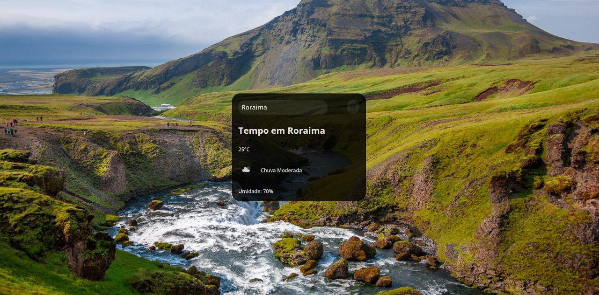
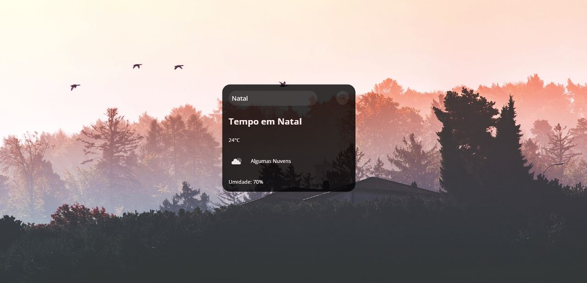

# App Previsão do Tempo

> Explorer

Projeto construído para reforçar conhecimentos adquiridos em desenvolvimento Front-End!

[ 🔗 Clique aqui para acessar](https://projeto-previsao-do-tempo-omega.vercel.app/)

## 🚀 Tecnologias

- HTML
- CSS
- Javascript
- Git e Github

## 💻 Projeto

O Projeto é um app de previsão do tempo que consome dados da API openweathermap.org sendo possível ver a cidade, temperatura, clima e umidade do ar de qualquer cidade do mundo, também é possível carregar um novo wallpaper de fundo toda vez que a página é recarregada.

# 💙 Contato

Email: jonhy.willy.jw71@gmail.com  
Linkedin: https://www.linkedin.com/in/jonhy-willy/

Feito com ♥ by Jonhy
